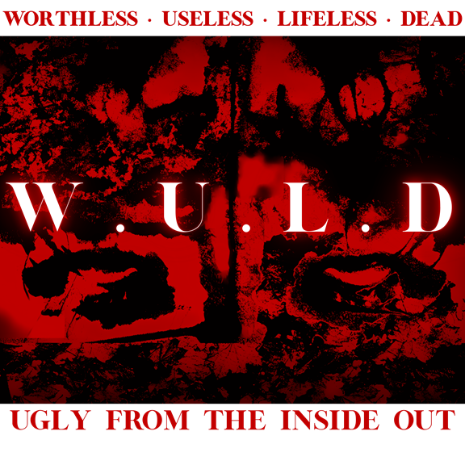

# wuld.ink

The multi-page umbrella for Josiah's (WULD / AnomicIndividual87 / Evilis Anihilis Uls) philosophical output: essays, glossary, the book *Malgré Tout*, the argument library, the Void Engine instrument, and the surrounding apparatus. Cloudflare end-to-end stack. Domain registered 2026-05-11.

Substrate aesthetic: neobrutalist dark-mode (canonical) with scoped accessibility modes (reader / high-contrast) on heavy-read containers. Typography: Cormorant Garamond (display) + IM Fell English (headlines) + EB Garamond (body) + IBM Plex Mono (chrome) — all self-hosted. Magnification slider 90–140% (K24c).

Live at [`wuld.ink`](https://wuld.ink) — single auto-deployed Cloudflare Pages project (`git push origin main` → live).

## Architecture

| Surface | Path | Status |
|---|---|---|
| Homepage (title page + destination index) | `/` | Live |
| Essays | `/essays/` | Live — Sanguinolentum Vestigium, Alogically Is, Architecture of Moral Disaster, A Life Inside |
| Book *Malgré Tout* | `/book/` (+ `/book/nothingist/`) | Live — cover + Mementos; chapters forthcoming |
| Glossary | `/glossary/` | Live — coined-vocabulary index (live + scaffolded entries) |
| Argument Library entry-point | `/argument-library/` | Live — surfaces the live library count + substrate cross-link |
| About the Library | `/library-about/` | Live — integrity-pinned to the current `library.wuld.ink` release |
| Long-form library extracts | `/coda/`, `/violence-as-reductio/`, `/why-not-suicide/` | Scaffold — editorial extraction pending |
| Blog | `/blog/` | Live — The Easiest Case + Load-Bearing |
| Void Engine instrument | `/void-engine/` | Live — 397-prompt generative lexicon (25 categories) + Signal / Transmission triptych |
| Frame (cold-reader entry) | `/frame/` | Live (K3) |
| Preface | `/preface/` | Live — anchor / entry page |
| Ne Hoc Fiat (project page) | `/ne-hoc-fiat/` | Live (K10) |
| Gallery | `/gallery/` | Live — plate index |
| Archive | `/archive/` | Live — videos + images + self-frame |
| Recommendations | `/recommendations/` | Live — curated film / books / sites / art / media |
| Music | `/music/` | Live — selected listening (YouTube link-out) |
| Watch (video link-out) | `/watch/` | Live — selected uploads grid |
| Changelog + RSS | `/changelog/` (+ `/feed.xml`) | Live — public release timeline + nav-glow indicator |
| Site search | `/search/` | Live — client-side over `/search-index.json`; spans pages, glossary, Void Engine, gallery plates, and every argument-library surface |
| Comment board / Chat | `/chat/` | Live — public comment board (Workers + D1, moderated) + IRC fallback |
| Support | `/donations/` | Live — PayPal / Cash App / Venmo cadences |
| Contact | `/contact/` | Live — Formspree form + email alias |
| Disclaimers | `/disclaimers/` | Live (K24a) — site-wide legal + personal disclaimers |
| Successor Protocol | `/_/successor-protocol/` | Sealed — Cloudflare Access OTP gate (operator-side) |

## Argument library

The systematic objection corpus lives in a separate repository (`alisendjsc-crypto/efilist-argument-library`) and is served from `library.wuld.ink`.

- **Flagship:** `combined.html` — 81 objections / 5 tiers / 35 mechanisms / 4-archetype interlocutor model, behind a top-nav (library / examples / coda). The live release's version, md5, and byte count are pinned on [`/library-about/`](https://wuld.ink/library-about/) (this README deliberately carries no version literals).
- **Refusal Suite:** four auto-deploying sibling wings — Right to Die, Abortion, Transgenderism, Anthropocentrism — plus a flagship-adjacent Veganism module, each served at `library.wuld.ink/<wing>/combined`. A `/libraries/` umbrella front door indexes them; objection cards carry per-card RSI grades and a plain / scholar reading toggle.
- **Discovery:** every argument-library surface is searchable from wuld.ink's `/search/`; `/library-about/` stays integrity-pinned to the deployed flagship md5.
- **License:** CC-BY-4.0 (content) + MIT (code).
- **Cross-link grammar:** `library.wuld.ink/combined#obj-<id>` (flagship) · `library.wuld.ink/<wing>/combined#obj-<id>` (wing) · `library.wuld.ink/libraries/` (umbrella).

See `docs/library-claude-coordination.md` for the append-only coordination relay with library-Claude.

## Screenshots

Drop site / library screenshots into `docs/screenshots/` and embed them here — conventions and drop instructions in `docs/screenshots/README.md`.

## Stack

| Layer | Service |
|---|---|
| Registrar | Cloudflare |
| Hosting | Cloudflare Pages (free tier; auto-deploy on `git push`) |
| Object storage | Cloudflare R2 (`wuld-audio` bucket → `audio.wuld.ink`) |
| Audio architecture | Per-paragraph selective; ElevenLabs generation offline → R2 upload → `<audio>` embed |
| DNS | Cloudflare (DNSSEC enabled) |
| TLS minimum on R2 custom domain | 1.2 |

## Audio architecture

Per-paragraph but **selective** — specific paragraphs across the site, not all. Controller at `/components/audio-player.js`; audio host at `audio.wuld.ink` (R2 public custom domain). Each audio block uses `data-audio-key="<path>"` to resolve to `https://audio.wuld.ink/<path>`.

Currently live: Sanguinolentum Vestigium (3 sections). Staged: Architecture of Moral Disaster (23:11 full reading, awaits R2 upload).

## Repository layout

| Path | Role |
|---|---|
| `src/` | Live site content (HTML/CSS/JS, all under `data-mode` cascade) |
| `src/tokens.css` | Design tokens (typography, colors × 3 modes, spacing, borders, motion) + `@font-face` declarations |
| `src/base.css` | Reset + element defaults; root font-size 18px × magnification scale |
| `src/components/` | Shared components (nav + nav-glow, footer, audio-player, ambient-player, mode-toggle + mag-slider, essay, glossary, void-engine, comment-board) |
| `src/fonts/` | Self-hosted WOFF2 typography (Cormorant Garamond, IM Fell English, EB Garamond) |
| `src/favicon.svg` | Site favicon (neobrutalist W on near-black ground, blood-red accent) |
| `src/releases.json` + `src/feed.xml` | Changelog source of truth + generated RSS feed |
| `tools/` | Build + maintenance tooling (changelog feed generator, library pin-mover, wuld-gui editor) |
| `workers/comments/` | Comment board backend (Cloudflare Worker + D1) |
| `docs/` | Coordination docs, brief, library substrate reference copies |
| `docs/library-claude-coordination.md` | Full cross-Claude coordination relay (append-only) |
| `docs/book-claude-coordination.md` | Book-project Claude coordination |
| `docs/successor-claude-coordination.md` | Successor Protocol coordination |
| `docs/wuld-ink-cowork-brief.md` | Full implementation brief |
| `docs/combined.html` + 3 regenerable sources | Library substrate reference copies (NOT deploy targets; see `docs/README-substrate.md`) |
| `docs/screenshots/` | Screenshots embedded in this README (drop instructions in `screenshots/README.md`) |
| `CLAUDE.md` | Cowork primer (active session context) |
| `CLAUDE-history.md` | Per-session narrative archive (K1 through prior trim point) |

## License

Content authored on this site: all rights reserved unless otherwise noted. The argument library substrate (separate repository) ships under CC-BY-4.0 (content) + MIT (code).

## Notes

- The argument library is a **separate project** (`efilist-argument-library`) consumed by wuld.ink; not a parent.
- Site work is coordinated via Cowork sessions; per-session narratives in `CLAUDE-history.md`.
- Cross-project coordination (library / book / successor protocol) uses append-only relay docs in `docs/*-coordination.md`.

See `docs/wuld-ink-cowork-brief.md` for the full architectural brief.
